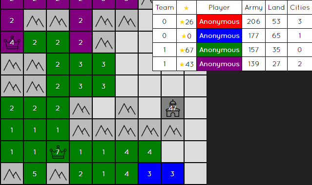

generals-city-counter
=========

A Chrome plugin that shows an estimated city count next to each player on [Generals.io](http://generals.io). A player's row will flash when their city count increases from zero. The extension uses the [statistical mode](https://en.wikipedia.org/wiki/Mode_(statistics)) from the last 10 turns (where the army count increased) to guess the number of cities.

#### Installation
Download the .crx file, then open Google Chrome and drag it onto the Extensions screen.

#### Screenshot

Cities are shown in the last column. Works for all game modes on EU and NA servers.
